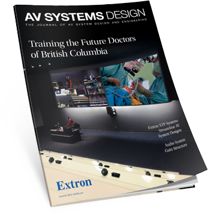

<link rel="stylesheet" type="text/css" href="/portfolio.css">

# AV System Design

## Digital Versions of the Journal of AV System Design and Engineering

AVSD was created to provide substantial technical articles and other information for AV professionals on subjects specifically related to systems design and engineering. Each quarterly issue features product and technology information, real-world case studies, problem-solving advice, tech tips, and valuable perspectives from experienced Extron professionals. My team was responsible for creating and distributing the digital versions of this journal, in both website and native iPad application formats.

## The Problem

Lorem ipsum dolor sit amet, consectetur adipisicing elit, sed do eiusmod tempor incididunt ut labore et dolore magna aliqua. Ut enim ad minim veniam, quis nostrud exercitation ullamco laboris nisi ut aliquip ex ea commodo consequat. Duis aute irure dolor in reprehenderit in voluptate velit esse cillum dolore eu fugiat nulla pariatur. Excepteur sint occaecat cupidatat non proident, sunt in culpa qui officia deserunt mollit anim id est laborum.

Key features of the app include:

- Feature 1
- Feature 2
- Feature 3
- Feature 4
- Feature 5

    

## Project Deliverables

<!-- Demo cards -->
<section class="gallery" lang="en">
  <figure class="card">
    <a href="#personas">
    

    <figcaption class="caption">Pers&shy;onas</figcaption>
    </a>
  </figure>
  <figure class="card">
    <a href="#scenarios-and-journey-maps">
    

    <figcaption class="caption">Scenar&shy;ios and Journey Maps</figcaption>
    </a>
  </figure>
  <figure class="card">
    <a href="#app-map">
    

    <figcaption class="caption">App Map</figcaption>
    </a>
  </figure>
  <figure class="card">
    <a href="#wireframes">
    

    <figcaption class="caption">Wire&shy;frames</figcaption>
    </a>
  </figure>
  <figure class="card">
    <a href="#prototype">
    

    <figcaption class="caption">Proto&shy;type</figcaption>
    </a>
  </figure>
  <figure class="card">
    <a href="#results">
    

    <figcaption class="caption">Results</figcaption>
    </a>
  </figure>
</section>

<em class="img-caption">Click a panel to jump to that section</em>

## The Process: Design, Validate, Iterate

Lorem ipsum dolor sit amet, consectetur adipisicing elit, sed do eiusmod tempor incididunt ut labore et dolore magna aliqua. Ut enim ad minim veniam, quis nostrud exercitation ullamco laboris nisi ut aliquip ex ea commodo consequat. Duis aute irure dolor in reprehenderit in voluptate velit esse cillum dolore eu fugiat nulla pariatur. Excepteur sint occaecat cupidatat non proident, sunt in culpa qui officia deserunt mollit anim id est laborum.

## Design Principles

Lorem ipsum dolor sit amet, consectetur adipisicing elit, sed do eiusmod tempor incididunt ut labore et dolore magna aliqua. Ut enim ad minim veniam, quis nostrud exercitation ullamco laboris nisi ut aliquip ex ea commodo consequat. Duis aute irure dolor in reprehenderit in voluptate velit esse cillum dolore eu fugiat nulla pariatur. Excepteur sint occaecat cupidatat non proident, sunt in culpa qui officia deserunt mollit anim id est laborum.

## Scenarios and Journey Maps

**Tool of choice: Omnigraffle**

Lorem ipsum dolor sit amet, consectetur adipisicing elit, sed do eiusmod tempor incididunt ut labore et dolore magna aliqua. Ut enim ad minim veniam, quis nostrud exercitation ullamco laboris nisi ut aliquip ex ea commodo consequat. Duis aute irure dolor in reprehenderit in voluptate velit esse cillum dolore eu fugiat nulla pariatur. Excepteur sint occaecat cupidatat non proident, sunt in culpa qui officia deserunt mollit anim id est laborum.

<a href="/img/lmb/scenario.png" target="_blank" class="noline">
*A sample scenario/journey map created from the personas and app requirements (click to view the whole thing)*</a>

## Retrospective
<!-- Lessons learned go here -->

This was a moderately sized project with many screens and interactions to keep track of. As such, a big takeaway was the importance of [working in an organized fashion][5]. Keeping track of all the parts can be daunting and good organizational skills quickly becomes just as important as good design skills.

Also, the value of peer and user feedback was extremely important in producing a better product. The ability to [give and receive quality critiques][6] really pushed me and my fellow designers. The **Design** > **Validate** > **Iterate** process proved invaluable in improving the quality of the finished app.

Finally, this project focused heavily on tools and process development. [Knowing my tools][7] and having (or in some cases developing) a solid kit of templates, typography, and assets really helped with productivity. I also spent a good amount of time developing [the 16:9 mobile app framework][8] that I used for this project; something that I'll continue to develop use again on other projects.

At the end of the day, Lunch Money Buddy is an app that provides a valuable service to parents of kids who have to work school lunches into their already busy schedule.

[1]: https://www.kent.edu/slis/uxd
[2]: /fidelity "Read more about my thoughts on wireframes and fidelity here"
