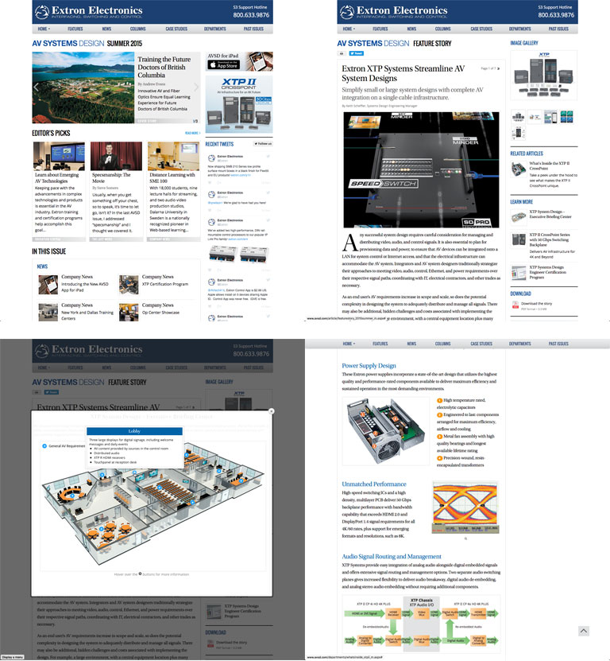
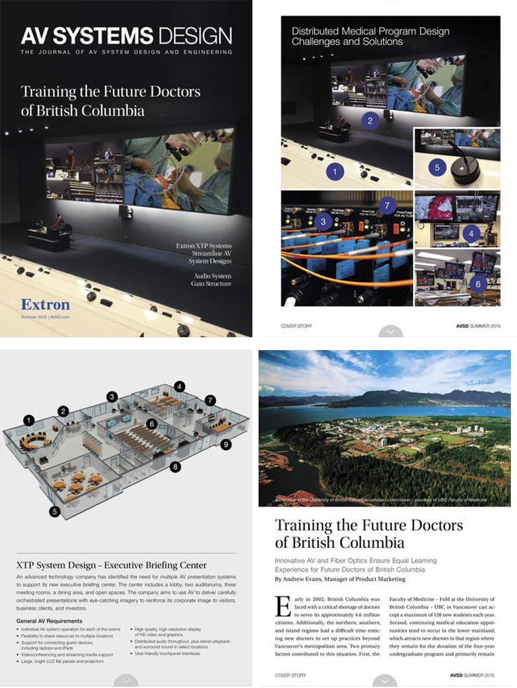

<link rel="stylesheet" type="text/css" href="/portfolio.css">

# AV System Design

## Digital Versions of the Journal of AV System Design and Engineering

AVSD was created to provide substantial technical articles and other information for AV professionals on subjects specifically related to systems design and engineering. Each quarterly issue features product and technology information, real-world case studies, problem-solving advice, tech tips, and valuable perspectives from experienced Extron professionals. My team was responsible for creating and distributing the digital versions of this journal, in both website and native iPad application formats.

## The Opportunity

When Extron wanted to expand international distribution of their quarterly journal, they didn't want to incur the additional cost of shipping that would entail, so we started looking at alternative methods of delivering this groundbreaking content in a compelling way. We decided that a website and a native iPad application would give us the opportunity to reach a broader audience, while also taking advantage of the interactive options the two platforms afforded us.

## AVSD.COM

[The AVSD website][1] offered us the opportunity to include more -- and more dynamic -- content to readers than we could have realistically done in traditional print. Interactive diagrams, audio and video all helped tell the story of each article in a very portable and universally accessible format.

*AVSD offers interactive diagrams and more in-depth analysis than the print version; surpassing the limitations and costs associated with traditional print*

## AVSD for iPad

[The iPad version][2] is a native iOS application with each issue designed in four layouts (portrait and landscape modes at standard and retina resolutions). Quality assurance was especially challenging, due to Apple's fairly restrictive provisioning and testing policies. Users installed a shell application, which notified them when new issues were available for download.

*AVSD for iPad really sets the bar for a beautiful, highly readable, interactive tablet experience. Numbered call-outs indicate areas where readers can tap to interact with the photos and diagrams to get more information*

## Cross-functional team

My team worked extensively with Extron's Marketing Communications group to come up with unique and compelling ways to tell the stories in each issue. MarComm copywriters, illustrators, and 3D modelers collaborated with my design and development teams to craft the content for each respective platform.

## Retrospective
<!-- Lessons learned go here -->

[1]: http://www.avsd.com
[2]: https://itunes.apple.com/us/app/avsd-for-ipad/id948828193?mt=8

