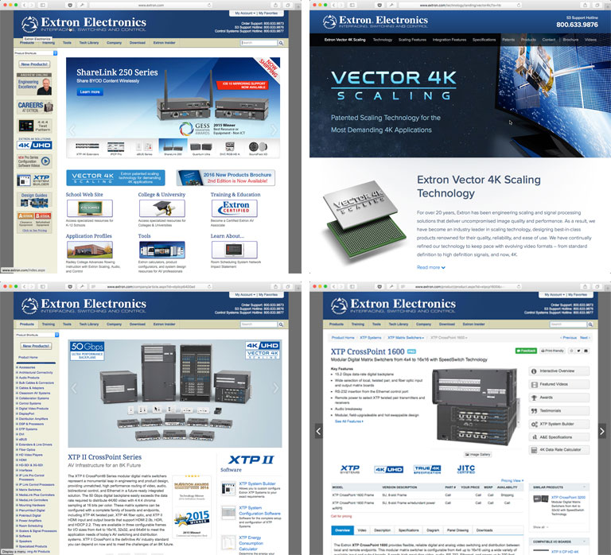

<link rel="stylesheet" type="text/css" href="/portfolio.css">

# Extron.com

## Industry-leading, Award-winning Website

For more than 15 years, [Extron Electronics' website][1] has won the raves of its customers, and the accolades of the industry. The corporate philosophy of "Service, Support, Solutions" is embodied in the vast wealth of product information and industry knowledge that this resource offers its B2B customers.

    

## If It Ain't Broke...

At first glance, the Extron website might not inspire thoughts of industry greatness. The homepage bears the same basic structural design that first graced the Internet 16 years ago. But continued incremental improvements to the product, training, and purchasing sections have Extron's reseller and consultant customer base consistently -- perhaps ironically -- imploring us: "Please don't change a thing!" Simply put, Extron.com is a stalwart; the picture of stability and usability in an engineering-focused industry that highly values utility over gloss.

Attracting 50,000 page views every day and generating $50 million in orders annually, Extron.com has won four industry awards, including -- most recently -- the [Stellar Service Award][4] from Systems Contractor News. The site offers all the information a customer might need on it [more than 2,000 product offerings][2], as well as a mobile-optimized version and online system builders and product configurations [tools and calculators][3].

    

[1]: http://www.extron.com/ "Extron Electronics"
[2]: http://www.extron.com/product "Extron Electronics Products"
[3]: http://www.extron.com/tools "Extron Electronics Tools"
[4]: http://www.avnetwork.com/article.aspx?articleid=123515 "2016 SCN Stellar Service Awards Winners"
