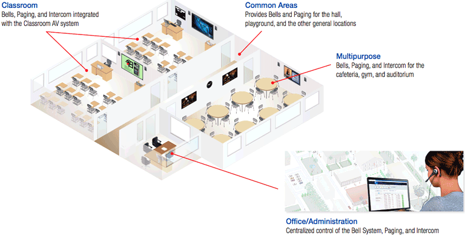
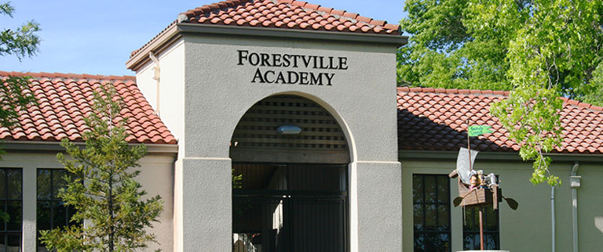
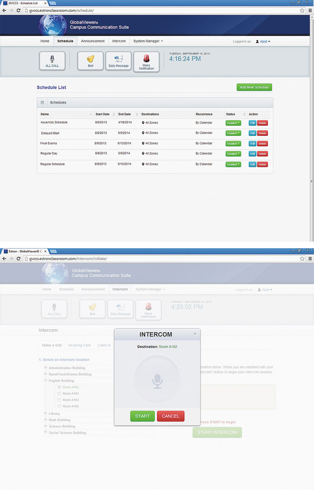

<link rel="stylesheet" type="text/css" href="/portfolio.css">

# GlobalViewer Campus Communication Suite

## Web-based Management of Bells, and PA Systems for Schools

The [GlobalViewer Campus Communication Suite][1] is a complete solution for unifying all campus audio systems under an easy-to-use interface. The suite leverages the power of your existing network to provide bells, public address announcements and intercom communications throughout campus. The user interface is web-based and allows office personnel to easily manage bell schedules, broadcast announcements to various zones, or have two-way conversations with classrooms.

## The Opportunity

K12 and higher education institutions were looking for a way to integrate their bell, paging and public address announcements into the tools that they were already using to manage their campus technology assets. At the time that we were approached to design and implement a solution, no one in the AV industry offered this type of feature and customers indicated that it would a difference-maker. Our objective was to quickly get a solution to market and **establish a competitive advantage** in this fast-growing market.

    

### Rapid Design, Validation and Iteration

Given the nature of education installation cycles (the window of opportunity to install new products is the few weeks between sessions in the summer and winter), we were given an extremely tight **deadline of three months** to build the product, from concept to deployment at [our first customer][2], the Forestville Unified School District in the Napa Valley region of Northern California. For this reason we adopted the "fail fast, fail often" mantra and collocated the entire team to engage in a collaborative, iterative design-validate-iterate process. Not only did we **meet our deadline**, but we were also **able to include additional features** not originally specified in the minimum viable product and our user interface was praised as being one of **the most user-friendly** the company had produced up to that point.

    

### Key features of the app include:

<ol>
<li class="snug">Manage bells, public address announcements, and intercom over an existing network</li>
<li class="snug">Intuitive graphical user interface accessible from a web browser</li>
<li class="snug">Flexible bell scheduling</li>
<li class="snug">Live and pre-recorded public address announcements</li>
<li class="snug">Integrated intercom system</li>
</ol>

### Sample Screens

    

## Results

The GlobalViewer Campus Communication Suite has been an overwhelming success. We succeeded in our goal of being first-to-market and the product is currently **utilized in over 2500 rooms** on K12 and university campuses throughout the United States. It is a product we continue to support, rolling out routine feature enhancement each June.

[1]: http://extronclassroom.com/product/GlobalViewer-Campus-Communication-Suite-gvccs
[2]: http://www.extron.com/company/article.aspx?id=forestville "Case Study: Forestville USD Improves Campus Communication with Extron Classroom AV Technology"