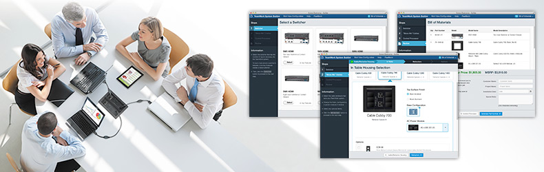

<link rel="stylesheet" type="text/css" href="/portfolio.css">

# TeamWork System Builder

## Customizable Collaboration for Conference Rooms and Workspaces

Extron TeamWork® is a fully customizable collaboration system that can be easily tailored to fit collaboration requirements, for up to eight users. With it, users can share their device's audio and video output on a common screen (like in a conference or board room). The companion [TeamWork System Builder][1] allows customers to choose from a wide range of Extron products to select the switcher, enclosure and "Show Me" cables or Retractors, and IP Link control processor that are best suited for their collaboration environment. 

    

## The Opportunity

Extron's TeamWork line of configurable collaboration offers AV Design Engineers and Consultants with the flexibility they need to provide their customers with state-of-the-art tools that fit their environments. When the product concept was introduced, customers had to work directly with Extron Sales staff to put together an often daunting list of products, accessories, and installation components -- **a time consuming process for both parties**. System requirements are not static throughout an AV design, bid, and installation process, so changes were often complicated and difficult to track.

We designed and built the TeamWork System Builder to allow Extron customers to design their systems on-the-fly in **a simple step-by-step process**, enabling them to easily see which accessories and installation pieces were needed for their specific environment -- all without needing to be on the phone with an Extron support representative.

    

### Key benefits

<ol>
  <li class="snug">Immediate feedback and results for Extron customers</li>
  <li class="snug">Reduced support overhead for Extron</li>
  <li class="snug">Flexibility to quickly adapt to changing system requirements</li>
  <li class="snug">A definitive parts list, a unique part number for each system, and price for inclusion in bids and contracts</li>
  <li class="snug">Tracking and analytics for Extron Sales, Marketing, and Product Development to help track opportunities and drive future product design decisions</li>
</ol>

### Screens

    
    <em>The simple, step-by-step process of the TeamWork System Builder</em>

## Results

Feedback from customers and sales has been **overwhelmingly positive** and Extron's Product Development team has used **metrics from the tool to drive recent product enhancements**. Additionally, the implementation of a unique part number for each configuration has resulted in **increased effeciency in Operations**, and **greater visibility for forecasting purposes** in our Sales and Product Marketing teams.

[1]: http://www.extron.com/product/twsb/index.aspx "TeamWork System Builder"
