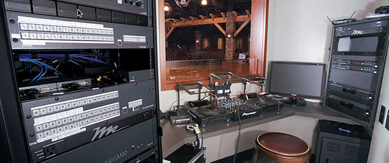
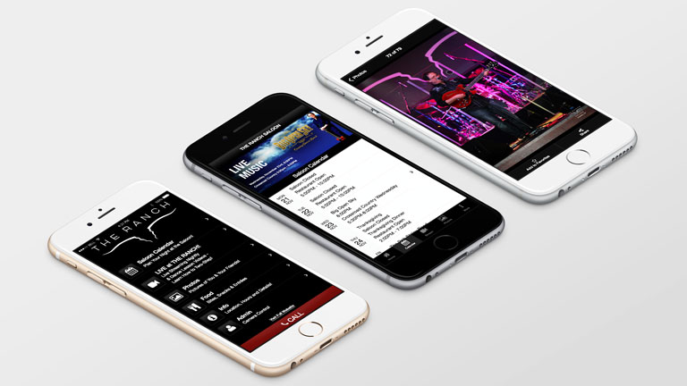

<link rel="stylesheet" type="text/css" href="/portfolio.css">

# The Ranch Saloon Mobile App

## Drinks, Dancing, and Fun in the Exclusive App for Orange County's Hottest Country Music Dancing and Live Music Spot

When Extron President Andrew Edwards decided to make [his personal vision and dream][1] of a state-of-the-art, fine dining and country music establishment a reality, he pulled out all the stops. The result is [The Ranch][2], two upscale venues -- one a top-flight restaurant, the other an exclusive dance hall -- that are among the best in Southern California. In addition to a memorable visit, he wanted to ensure that customers could also get an exciting and compelling experience while on the go.

    

## The Opportunity

Enter [The Ranch Saloon Mobile App][3].

We built the Saloon app to provide patrons with a way to share their experience on the dance floor with friends and family, as well as a way to get the latest on upcoming acts, menu, and venue information. From the business side of things, the app provides The Ranch a way to stay in the front of their customers' minds, keeping the restaurant and saloon on their respective dining and entertainment radars in an exceedingly competitive market.

Key features of the app include:

<ol>
  <li class="snug"><strong>Live Streaming Video:</strong> Users can tune in to see live country music acts or watch as pro dancers teach the latest country western steps</li>
  <li class="snug"><strong>Nightly photos</strong> of the fun and revelry on the dance floor that guests can download and share on social media</li>
  <li class="snug"><strong>Saloon calendar</strong> of events</li>
  <li class="snug"><strong>Menu</strong></li>
</ol>

## Streaming Video: Working With the Guys Upstairs

The Ranch sits on the first floor of what is Extron Electronic's world headquarters in Anaheim, California. This gave us access to some of the best AV engineering in the world, just a few floors above. As a result, we were able to work with Extron engineers to design a state-of-the-art streaming solution for the nightly video.

    

### Extron Hardware
We had access to [prototype streaming hardware][4] (which Extron has since released as its flagship streaming solution) and a full rack of switching and processing equipment. Working with the product engineers, this project served as a proof-of-concept for some AV streaming solutions that are now becoming mainstream in the industry.

### Wowza!
From the software side of things, we worked with Microsoft to leverage their [Azure cloud solution][5] to work with [Wowza Media Systems' cloud streaming infrastructure][6]. Microsoft gave us the scalability we needed, and Wowza made the software implementation a relatively painless one.

    

## Retrospective
<!-- Lessons learned go here -->

This was one of the most unusual and exciting projects my team has had the pleasure of working on. Integrating with a variety of hardware and software solutions was challenging and ultimately rewarding. Also, the opportunity to work with a variety of stakeholders, engineers, and product development managers really gave me a newfound respect for the work that they have to do. To sit in an office and talk about products in the abstract is one thing; to walk into a real environment -- with all of its challenges, technical hurdles, and physical contstraints -- and design a working solution was very rewarding.

[1]: http://www.ocregister.com/articles/edwards-230074-orange-extron.html "Steak and electronics, anyone?"
[2]: theranch.pdf "AVSD Cover Story - The Ranch"
[3]: http://saloon.theranch.com/ "The Ranch Saloon App"
[4]: http://www.extron.com/product/product.aspx?id=smp351&subtype=481&s=10&src=drw "Extron Electronics - SMP 351 - H.264 Streaming Media Processor"
[5]: http://azure.microsoft.com/ "Microsoft Azure: Cloud Computing Platform & Services"
[6]: http://www.wowza.com/ "Wowza Media Systems"
