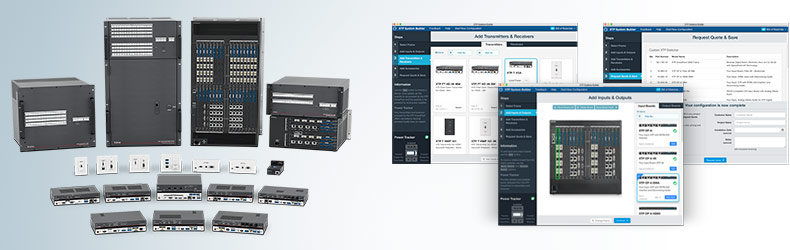
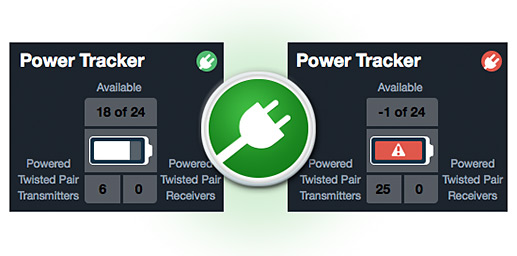
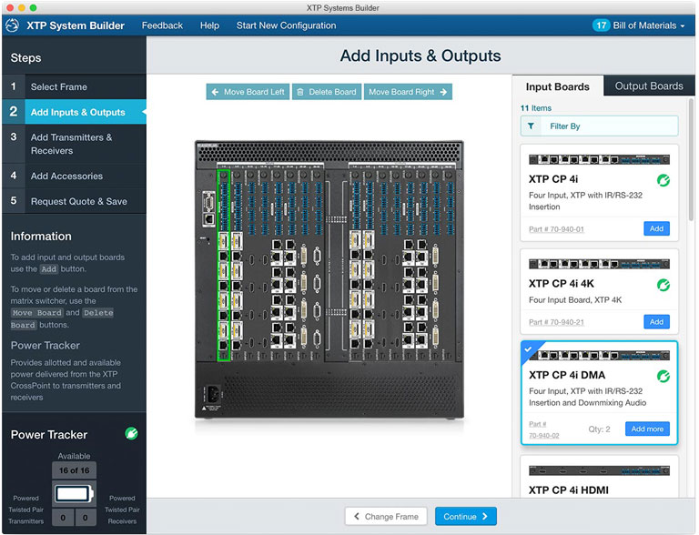
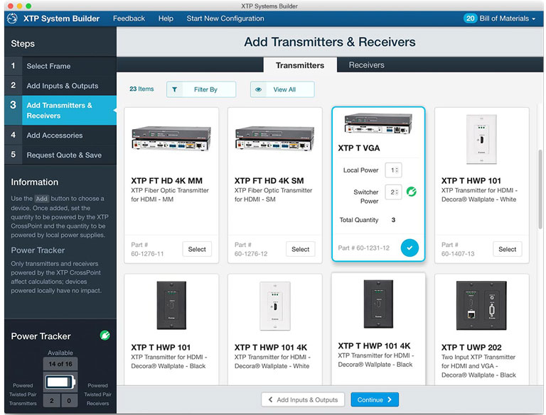
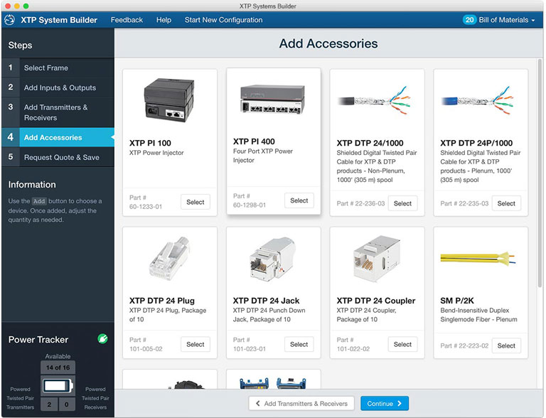

<link rel="stylesheet" type="text/css" href="/portfolio.css">

# XTP System Builder

## Full configuration of high-end AV switching systems

Extron's flagship XTP Systems provide large-scale, modular AV switching and control. This system is the premier digital AV solution, ideal for corporate, government, healthcare, and network operations environments.

    

## The Opportunity

XTP Systems are extremely flexible and powerful, but they are also highly complex and not inexpensive. When we initially introduced the XTP Switching products, customers were forced to work closely with Extron Sales Engineers to work through the myriad options and accessories such a system offered. It was time consuming for the customer, and put a strain on our support team.

[The XTP System Builder][1] is an online tool that allows AV system design engineers and consultants to quickly and easily configure complex, large scale switching systems. With a few clicks of the mouse, their XTP System evolves from an empty frame to a complete design that includes extenders, accessories, and cabling. XTP System Builder generates an as-configured custom part number for the XTP matrix switcher and compiles all selected components into a single equipment list, making a once-complex and burdensome process simple and convenient.

    

Key features of the app include:

<ol>
  <li class="snug"><strong>Intuitive user interface</strong> for quick, easy configuration</li>
  <li class="snug"><strong>Power Tracker:</strong> All of those components use power. The Power Tracker feature lets the customer keep an eye on power consumption, ensuring efficient usage upon installation.</li>
  <li class="snug"><strong>Bill of Materials:</strong> Customers can easily save product lists in formats that import easily into system quotes, design plans, or email</li>
  <li class="snug"><strong>Custom Part Number:</strong> Customers get a single part number, convenient for including in contracts, quotes, and bids.</li>
</ol>

## User Centered Design

We invested heavily in user research for this project, including extensive user interviews, prototyping, and usability testing. Leveraging our [Usability Lab][2], the team was able to bring in Design Engineers and Consultants and have them perform task-oriented usability sessions while the design and development teams watched from a remote conference room. The results were compelling, as team members could see firsthand where their design decisions presented problems for real users. This fueled our intensive [design-validate-iterate process][3] and allowed us to quickly react to changes while still moving forward towards our deployment deadline.

    
    <em>Our Usability Lab, with remote observation rig.</em>

## Design Decisions Driven By Research

    
    <em>With such a large selection of potential boards for our modular switching chassis, the XTP System Builder makes it easy to find the Input and Output options our customers need for their particular solution. Little things like the <strong>"Filter By"</strong> control in the right-hand panel made a huge difference for users.</em>
     

    
    <em>Research showed that <strong>a visual, card-based grid</strong> was the most effective method of offering choices to users. Believe it or not, they actually look at those little grey boxes when choosing their options. The <strong>Power Tracker feature</strong> was a critical element that users told us gave them added confidence when building their systems.</em>
     

    
    <em>Our customers told us in interviews that <strong>accessories were a nagging inconvenience</strong> for them when customizing a complex system. Seemingly trivial items like adapters and couplers would easily get missed and derail an otherwise straightforward installation. As a result, we added an accessories step to the Sytem Builder.</em>
     

## Retrospective
<!-- Lessons learned go here -->
As Extron's flagship product line, it was critical that we make the XTP as easy to use as possible. With extensive research and testing, we were able to quickly provide a product solution that we were confident would meet the needs of our customers, while relieving pressure from our support teams and having a positive impact on the company's bottom line.

[1]: http://www.extron.com/product/xtpsc/index.aspx?src=drw "XTP System Builder"
[2]: /remote-ux-observation "Remote UX Observation"
[3]: /portfolio/#the-process-design-validate-iterate "The Process: Design, Validate, Iterate"